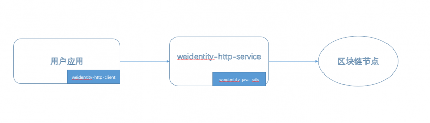
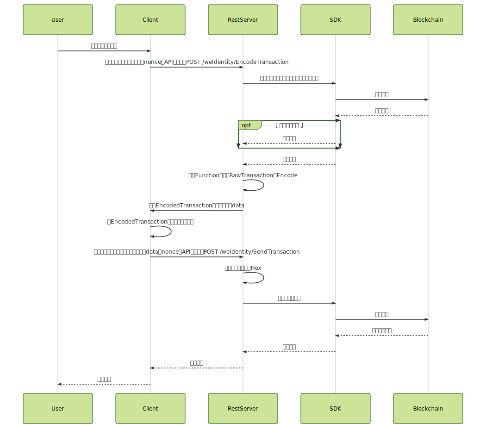
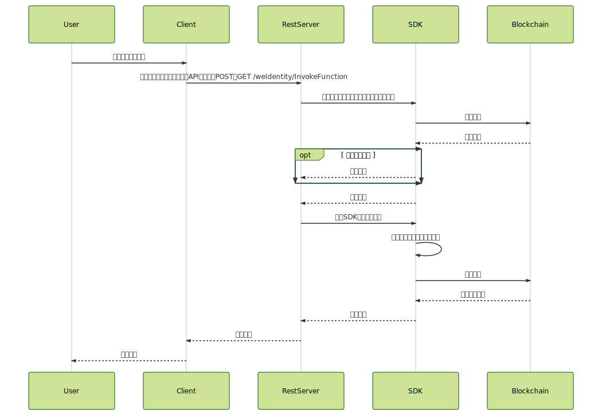
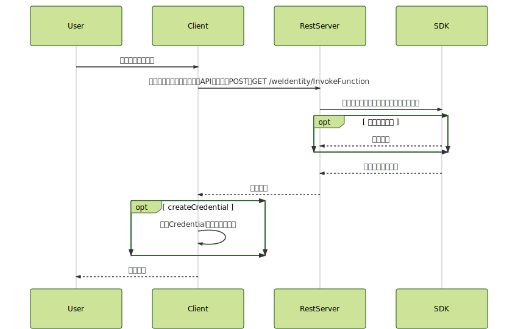

.. _weidentity-rest-design:

WeIdentity RestService设计文档
================================

1. 设计理念
------------

- 当前，SDK的很多接口使用了私钥，其目的在于为了发送交易到区块链的时候对交易进行签名。然而，在强调隐私的场景中，由于不存在一种能够安全地将用户的私钥发送到SDK服务器的方式，因此可能会导致用户私钥泄露。为解决该问题，RestService将「用户使用自己的私钥签名」这一动作迁移到用户端。
- 未来，用户的发交易需求可能不限制于对WeIdentity SDK，也包括WeEvent、WeSign等其他组件，而客户可能不愿意安装多个SDK。为解决该问题，RestService提供了一整套通用的各SDK的访问逻辑、参数定义解决方案，使得用户的签名操作与具体业务、具体SDK、具体合约解耦。
- 此外，机构或用户可能不支持使用Java环境调用SDK；对此，RestService的另一个目的便是为了降低多语言版本的SDK的开发成本。

RestService选择采用「轻客户端 + 轻Java Server对接各SDK」的架构。其中轻客户端仅需要包含最基础的签名、随机数、及HTTP请求发送功能；机构或用户通过轻客户端访问RestService的对应API即可完成相关功能。我们提供了一个轻客户端的样例，同时也提供了REST调用方式的API接口文档说明；未来，我们还将会提供更多工具包以增强易用性。

RestService的所有API均为无状态的。

2. 技术实现说明
---------------

2.1 架构图
^^^^^^^^^^^

RestService架构包括以下模块：

* 用户应用：用户的业务app应用，调用Client
* weidentity-java-client：Rest Client客户端，负责执行签名操作
* weidentity-http-service：Rest Server服务端
* weidentity-java-sdk：WeIdentity的SDK

2.2 改进的交易流程
^^^^^^^^^^^^^^^^^^^^

过去的做法是：

* 用户传入接口参数，直接调用restful接口，weidentity-http-service调用sdk然后发送交易；

改造后：
* 用户应用调用weidentity-java-client，生成相应的业务参数签名及参数，然后POST http://localhost:20191/weIdentity/encodedTransaction，发送请求给weidentity-http-service
* weidentity-http-service接受请求，返回EncodedTransaction给weidentity-java-client
* 用户应用调用weidentity-java-client，生成交易签名，然后POST http://localhost:20191/weIdentity/sendTransaction，发送请求给weidentity-http-service
* weidentity-http-service接受请求，调用weidentity-java-sdk的对应方法，发送交易给区块链节点

3. 时序图
------------

我们将当前已有的WeIdentity SDK API的调用模式重新分类成三类，分别为需要私钥签名的链上API调用模式、不需私钥签名的链上API调用模式、及不需区块链交互的API调用模式。简单描述三类的时序图如下：

3.1 需要私钥签名的链上API调用
^^^^^^^^^^^^^^^^^^^^^^^^^^^^^

说明：这里Client端需要做三步：

- Client首先需要组装方法名、业务输入参数、用于交易的nonce随机数、API版本号这四个变量，随后发送POST请求，要求编码交易。RestService会访问SDK进行入参检测，若通过，则返回给Client编码交易结果及特征值。
- Client的第二步是使用私钥对编码交易结果进行签名。
- Client最后一步是组装方法名、签名值、交易特征值、nonce随机数、API版本号这五个变量并发送POST请求，要求发送交易。RestService会访问SDK进行裸合约调用，并返回执行结果。

这种设计是因为某些WeIdentity的功能需要调用方使用自身的私钥。为了避免私钥通过网络传输而引发的可能隐私泄露，故需要单独将签名这一步放到Client端执行。此调用模式的功能包括：

- CreateWeId
- RegisterAuthorityIssuer
- RegisterCpt

3.2 不需私钥签名的链上API调用
^^^^^^^^^^^^^^^^^^^^^^^^^^^^

说明：这里Client端只需一步，即组装方法名、业务输入参数、API版本号这三个变量，并发送POST/GET请求。RestService会进行入参检测后调用区块链相关合约方法并返回结果。本部分也包括原有的、未改造的SDK API。如果直接调用这些API，则需要预先在RestService端对私钥进行托管。

符合此调用模式的功能包括：

- 所有非其他两类功能
- 此外，原有的、需要私钥托管的API也在此范畴内

3.3 不需区块链交互的API调用
^^^^^^^^^^^^^^^^^^^^^^^^^^^^^

说明：这里Client端包括两步：

- 首先Client端组装方法名、业务输入参数、API版本号这三个变量，并发送POST/GET请求。RestService会进行入参检测后补齐其他参数返回。
- 之后Client端对参数进行其他处理并返回给客户（如创建凭证时的签名操作）。

符合此调用模式的功能包括：

- CreateCredential
